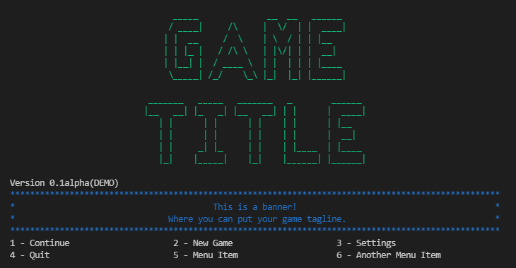

# Classes

## GameMap()
*Module: tage_map*

## MapTile()
*Module: tage_map*

### Class Variables

### Class Functions:
#### intro_text()

#### __str__()

#### inspect_list()

#### add_item()

#### remove_item()

#### check_item()

#### has_inventory()

#### tile_inventory()

#### set_spawn_rate()

#### __add_spawn_item()
*PRIVATE FUNCTION*

See [add_spawn_item()](#add_spawn_item)

#### add_spawn_item()

#### __spawn_item()
*PRIVATE FUNCTION*

See [spawn_item()](#spawn_item)

#### spawn_item()
## StartTile()
*Module: tage_map*

*Extends [MapTile()](#maptile)*

**Class Functions**:

## TitleScreen()

### Class Variables
* title
* titleFont
* width
* color
* bannerText
* bannerColor
* caption
* menu

### Class Functions:
**add_title_line()**

**add_banner_line()**

**add_menu_item()**

**render_title()**

**render_menu()**

**render_title_screen()**

#### ex:
```python
    from tage_title_screen import *

    # Add Title Screen Text
    testScreen = TitleScreen(title="G A M E")
    testScreen.add_title_line("T I T L E")
    # Set Title Screen Text Color
    testScreen.color = "green"
    # Add Caption
    testScreen.caption = "Version 0.1alpha(DEMO)"
    # Set Title Screen Width
    testScreen.width = 100
    # Add Banner Text
    testScreen.add_banner_line("This is a banner!")
    testScreen.add_banner_line("Where you can put your game tagline.")
    # Set Banner Color
    testScreen.bannerColor = "blue"
    # Add Title Screen Menu
    testScreen.add_menu_item(["Continue", "New Game", "Settings", "Quit", "Menu Item", "Another Menu Item"])
    # Render Title Screen
    testScreen.render_title_screen()
```

# Modules

## tageutils
### clearScreen()
OS independed method of clearing the console

### transfer_item()
Transfers an inventory item between two(2) objects with an inventory

**ex:**
```python
from tageutils import *
from tage_player import Player
from tage_items import Item
from tage_map import MapTile

# Create Player, Item, and MapTile Objects
p = Player("Test Player")
i = Item("Test Item", "This is a test item.", 100)
m = MapTile("Test Tile")

# Add one(1) "Test Item" to MapTile Inventory
m.add_item(i, 1)

# Check m and p for item in inventory
m.check_item("test item")
'True'

p.check_item("test item")
'False'

# Transfer item from the MapTile to the Player
transfer_item(i, m, p)

# Check m and p for item in inventory
m.check_item("test item")
'False'

p.check_item("test item")
'True'
```