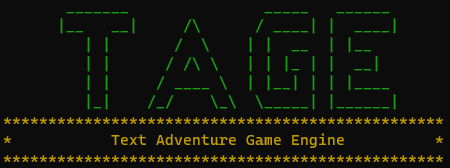

# TAGE
**Text Adventure Game Engine** 

### Links
* [Code Reference](Code-Reference.md)
* [Release Notes]
* [Tutorial]

#### Social Media
* [Reddit r/ta_gameengine](https://www.reddit.com/r/ta_gameengine)
* [Discord](https://discord.gg/PRDU9PdSa9)

## Why?
I want to create a series of games for my daughter to play. My plan is to start with text based adventure games with stories she can interact with, solve simple puzzles, and hopefully some day help to create.

My wife wants to help create some of the games. She is a talented writer but has no programming experience (And zero desire to learn). Instead of me spending time programming the stories my wife comes up with, I decided to create this game engine and come up with a simple script. I can create games and develop new mechanics in the engine, and she can follow a simple formatted script to render a functioning game.

My goal is that this engine can be used by people who may not have the programming experience, or desire to learn programming, but would like to create a game that they could share.

## Important Information
I will put important information here when I have some
